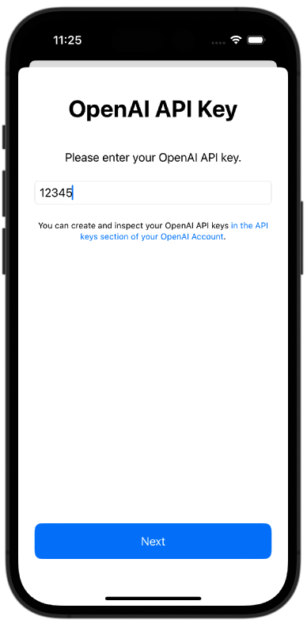
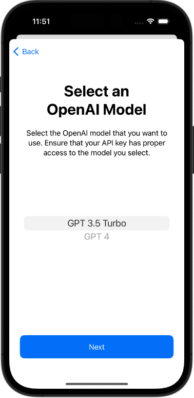
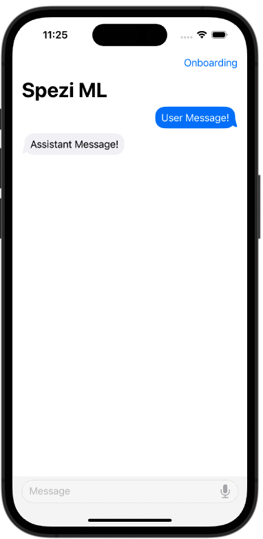

<!--
                  
This source file is part of the Stanford Spezi open source project

SPDX-FileCopyrightText: 2023 Stanford University and the project authors (see CONTRIBUTORS.md)

SPDX-License-Identifier: MIT
             
-->

# Spezi ML

[](https://github.com/StanfordSpezi/SpeziML/actions/workflows/build-and-test.yml)
[](https://codecov.io/gh/StanfordSpezi/SpeziML)
[](https://doi.org/10.5281/zenodo.7954213)
[](https://swiftpackageindex.com/StanfordSpezi/SpeziML)
[](https://swiftpackageindex.com/StanfordSpezi/SpeziML)


# Overview

The Spezi ML Swift Package includes modules that are helpful to integrate ML-related functionality in your application.

# Spezi Open AI

A module that allows you to interact with GPT-based large language models (LLMs) from OpenAI within your Spezi application.

|<picture><source media="(prefers-color-scheme: dark)" srcset="Sources/SpeziOpenAI/SpeziOpenAI.docc/Resources/OpenAIAPIKeyOnboardingStep~dark.png"></picture>|<picture><source media="(prefers-color-scheme: dark)" srcset="Sources/SpeziOpenAI/SpeziOpenAI.docc/Resources/OpenAIModelSelectionOnboardingStep~dark.png"></picture>|<picture><source media="(prefers-color-scheme: dark)" srcset="Sources/SpeziOpenAI/SpeziOpenAI.docc/Resources/ChatView~dark.png"></picture>|
|:--:|:--:|:--:|
|`API Key Onboarding`|`Model Selection`|`Chat View`|


## Setup

### 1. Add Spezi ML as a Dependency

First, you will need to add the SpeziML Swift package to
[your app in Xcode](https://developer.apple.com/documentation/xcode/adding-package-dependencies-to-your-app#) or
[Swift package](https://developer.apple.com/documentation/xcode/creating-a-standalone-swift-package-with-xcode#Add-a-dependency-on-another-Swift-package). When adding the package, select the `SpeziOpenAI` target to add.

### 2. Register the Open AI Component

> [!IMPORTANT]
> If your application is not yet configured to use Spezi, follow the [Spezi setup article](https://swiftpackageindex.com/stanfordspezi/spezi/documentation/spezi/initial-setup) to set up the core Spezi infrastructure.

You can configure the `OpenAIComponent` in the `SpeziAppDelegate` as follows.

```swift
import Spezi
import SpeziOpenAI


class ExampleDelegate: SpeziAppDelegate {
    override var configuration: Configuration {
        Configuration {
            OpenAIComponent(apiToken: "API_KEY", openAIModel: .gpt4)
        }
    }
}
```

In the example above, we have configured the `OpenAIComponent` to use the GPT-4 model with a default API key. Note that the choice of model and API key are persisted across application launches. The `apiToken` and `openAIModel` can also be accessed and changed at runtime. 

The `SpeziOpenAI` package also provides an `OpenAIAPIKeyOnboardingStep` that can be used to allow the user to provide their API key during the onboarding process instead (see `Examples` below). If using the `OpenAIAPIKeyOnboardingStep`, the `apiToken` property can be omitted here.

> [!NOTE]  
> You can learn more about a [`Component` in the Spezi documentation](https://swiftpackageindex.com/stanfordspezi/spezi/documentation/spezi/component).

## Examples

### Creating a Chat Interface

In this example, we will create a chat interface that allows the user to converse with the model. Responses from the model will be streamed.

```swift
import OpenAI
import SpeziOpenAI
import SwiftUI

struct OpenAIChatView: View {
    @EnvironmentObject private var openAIComponent: OpenAIComponent
    @State private var chat: [Chat]
    
    var body: some View {
        ChatView($chat)
            .onChange(of: chat) { _ in
                let chatStreamResults = try await openAIComponent.queryAPI(withChat: chat)
                
                for try await chatStreamResult in chatStreamResults {
                    for choice in chatStreamResult.choices {
                        guard let newContent = choice.delta.content else {
                            continue
                        }
                        
                        if chat.last?.role == .assistent, let previousContent = chat.last?.content {
                            chat[chat.count - 1] = Chat(
                                role: .assistant,
                                content: previousContent + newContent
                            )
                        } else {
                            chat.append(Chat(role: .assistent, content: newContent))
                        }
                    }
                }
            }
    }
}
```

### Setting the API Key During Onboarding

The `OpenAIAPIKeyOnboardingStep` provides a view that can be used for the user to enter an OpenAI API key during onboarding in your Spezi application. We will show an example of how you can add an OpenAI onboarding step within an application created from the Spezi Template Application below.

First, create a new view to show the onboarding step:

```swift
import SpeziOnboarding
import SpeziOpenAI
import SwiftUI


struct OpenAIAPIKey: View {
    @EnvironmentObject private var onboardingNavigationPath: OnboardingNavigationPath
    
    var body: some View {
        OpenAIAPIKeyOnboardingStep {
            onboardingNavigationPath.nextStep()
        }
    }
}
```

This view can then be added to the `OnboardingFlow` within the Spezi Template Application:

```swift
import SpeziOnboarding
import SpeziOpenAI
import SwiftUI


struct OnboardingFlow: View {
    @AppStorage(StorageKeys.onboardingFlowComplete) var completedOnboardingFlow = false
    
    
    var body: some View {
        OnboardingStack(onboardingFlowComplete: $completedOnboardingFlow) {
            // ... other steps
            OpenAIAPIKey()
            // ... other steps
        }
    }
}
```

Now the OpenAI API Key entry view will appear within your application's onboarding process. The API Key entered will be persisted across application launches.

For more information, please refer to the [API documentation](https://swiftpackageindex.com/StanfordSpezi/SpeziML/documentation).

## Contributing

Contributions to this project are welcome. Please make sure to read the [contribution guidelines](https://github.com/StanfordSpezi/.github/blob/main/CONTRIBUTING.md) and the [contributor covenant code of conduct](https://github.com/StanfordSpezi/.github/blob/main/CODE_OF_CONDUCT.md) first.


## License

This project is licensed under the MIT License. See [Licenses](https://github.com/StanfordSpezi/SpeziML/tree/main/LICENSES) for more information.


