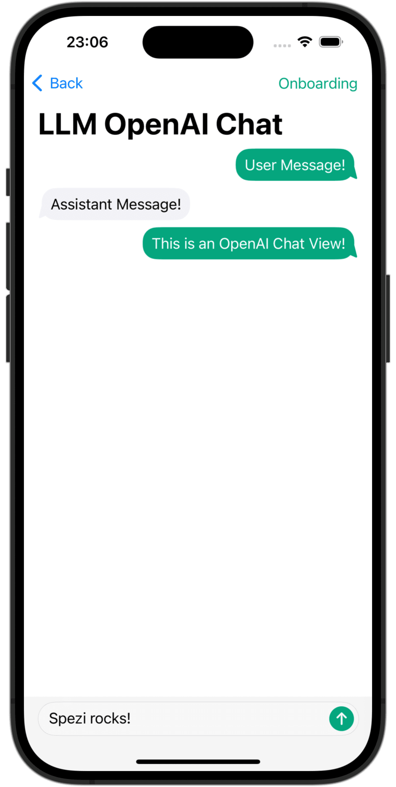
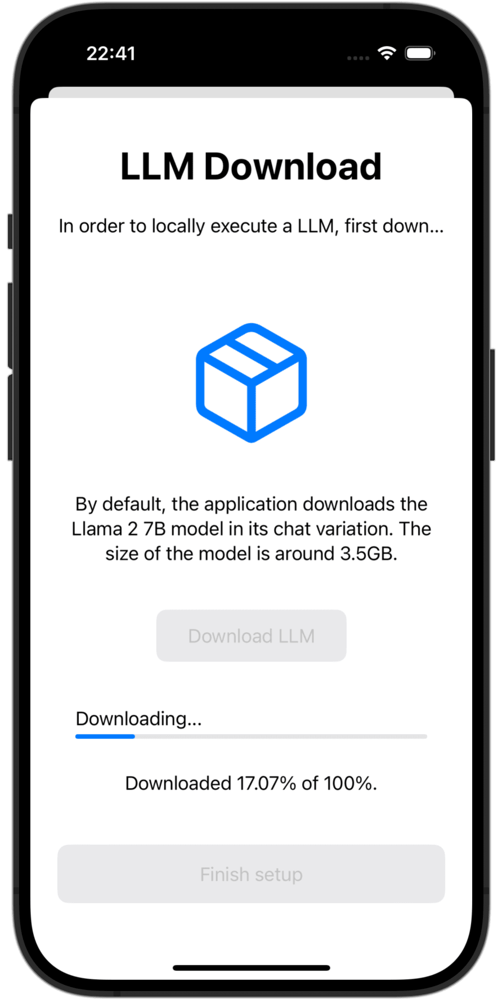

<!--
                  
This source file is part of the Stanford Spezi open source project

SPDX-FileCopyrightText: 2023 Stanford University and the project authors (see CONTRIBUTORS.md)

SPDX-License-Identifier: MIT
             
-->

# Spezi LLM

[](https://github.com/StanfordSpezi/SpeziLLM/actions/workflows/build-and-test.yml)
[](https://codecov.io/gh/StanfordSpezi/SpeziLLM)
[](https://doi.org/10.5281/zenodo.7954213)
[](https://swiftpackageindex.com/StanfordSpezi/SpeziLLM)
[](https://swiftpackageindex.com/StanfordSpezi/SpeziLLM)


## Overview

The Spezi LLM Swift Package includes modules that are helpful to integrate LLM-related functionality in your application.
The package provides all necessary tools for local LLM execution, the usage of remote OpenAI-based LLMs, as well as LLMs running on Fog node resources within the local network.

|<picture><source media="(prefers-color-scheme: dark)" srcset="Sources/SpeziLLMOpenAI/SpeziLLMOpenAI.docc/Resources/ChatView~dark.png"></picture>|<picture><source media="(prefers-color-scheme: dark)" srcset="Sources/SpeziLLMLocalDownload/SpeziLLMLocalDownload.docc/Resources/LLMLocalDownload~dark.png"></picture>|<picture><source media="(prefers-color-scheme: dark)" srcset="Sources/SpeziLLMLocal/SpeziLLMLocal.docc/Resources/ChatView~dark.png"></picture>|
|:--:|:--:|:--:|
|`OpenAI LLM Chat View`|`Language Model Download`|`Local LLM Chat View`|

## Setup

### 1. Add Spezi LLM as a Dependency

You need to add the SpeziLLM Swift package to
[your app in Xcode](https://developer.apple.com/documentation/xcode/adding-package-dependencies-to-your-app#) or
[Swift package](https://developer.apple.com/documentation/xcode/creating-a-standalone-swift-package-with-xcode#Add-a-dependency-on-another-Swift-package).

> [!IMPORTANT]  
> If your application is not yet configured to use Spezi, follow the [Spezi setup article](https://swiftpackageindex.com/stanfordspezi/spezi/documentation/spezi/initial-setup) to set up the core Spezi infrastructure.

### 2. Follow the setup steps of the individual targets

As Spezi LLM contains a variety of different targets for specific LLM functionalities, please follow the additional setup guide in the respective target section of this README.

## Targets

Spezi LLM provides a number of targets to help developers integrate LLMs in their Spezi-based applications:
- [SpeziLLM](https://swiftpackageindex.com/stanfordspezi/spezillm/documentation/spezillm): Base infrastructure of LLM execution in the Spezi ecosystem.
- [SpeziLLMLocal](https://swiftpackageindex.com/stanfordspezi/spezillm/documentation/spezillmlocal): Local LLM execution capabilities directly on-device. Enables running open-source LLMs from Hugging Face like [Meta's Llama2](https://ai.meta.com/llama/), [Microsoft's Phi](https://azure.microsoft.com/en-us/products/phi), [Google's Gemma](https://ai.google.dev/gemma), or [DeepSeek-R1](https://huggingface.co/deepseek-ai/DeepSeek-R1), among others. See [LLMLocalModel](https://swiftpackageindex.com/stanfordspezi/spezillm/main/documentation/spezillmlocal/llmlocalmodel) for a list of models tested with SpeziLLM.
- [SpeziLLMLocalDownload](https://swiftpackageindex.com/stanfordspezi/spezillm/documentation/spezillmlocaldownload): Download and storage manager of local Language Models, including onboarding views. 
- [SpeziLLMOpenAI](https://swiftpackageindex.com/stanfordspezi/spezillm/documentation/spezillmopenai): Integration with OpenAI's GPT models via using OpenAI's API service.
- [SpeziLLMFog](https://swiftpackageindex.com/stanfordspezi/spezillm/documentation/spezillmfog): Discover and dispatch LLM inference jobs to Fog node resources within the local network.

The section below highlights the setup and basic use of the [SpeziLLMLocal](https://swiftpackageindex.com/stanfordspezi/spezillm/documentation/spezillmlocal), [SpeziLLMOpenAI](https://swiftpackageindex.com/stanfordspezi/spezillm/documentation/spezillmopenai), and [SpeziLLMFog](https://swiftpackageindex.com/stanfordspezi/spezillm/documentation/spezillmfog) targets in order to integrate Language Models in a Spezi-based application. 

> [!NOTE]  
> To learn more about the usage of the individual targets, please refer to the [DocC documentation of the package](https://swiftpackageindex.com/stanfordspezi/spezillm/documentation).

### Spezi LLM Local

The target enables developers to easily execute medium-size Language Models (LLMs) locally on-device. The module allows you to interact with the locally run LLM via purely Swift-based APIs, no interaction with low-level code is necessary, building on top of the infrastructure of the [SpeziLLM target](https://swiftpackageindex.com/stanfordspezi/spezillm/documentation/spezillm).

> [!IMPORTANT]  
> Spezi LLM Local is not compatible with simulators. The underlying [`mlx-swift`](https://github.com/ml-explore/mlx-swift) requires a modern Metal MTLGPUFamily and the simulator does not provide that.

> [!IMPORTANT]
> Important: To use the LLM local target, some LLMs require adding the *Increase Memory Limit* entitlement to the project.

#### Setup

You can configure the Spezi Local LLM execution within the typical `SpeziAppDelegate`.
In the example below, the `LLMRunner` from the [SpeziLLM](https://swiftpackageindex.com/stanfordspezi/spezillm/documentation/spezillm) target which is responsible for providing LLM functionality within the Spezi ecosystem is configured with the `LLMLocalPlatform` from the [SpeziLLMLocal](https://swiftpackageindex.com/stanfordspezi/spezillm/documentation/spezillmlocal) target. This prepares the `LLMRunner` to locally execute Language Models.

```swift
class TestAppDelegate: SpeziAppDelegate {
    override var configuration: Configuration {
        Configuration {
            LLMRunner {
                LLMLocalPlatform()
            }
        }
    }
}
```

[SpeziLLMLocalDownload](https://swiftpackageindex.com/stanfordspezi/spezillm/documentation/spezillmlocaldownload) can be used to download an LLM from [HuggingFace](https://huggingface.co/) and save it on the device for execution. The `LLMLocalDownloadView` provides an out-of-the-box onboarding view for downloading models locally.

```swift
struct LLMLocalOnboardingDownloadView: View {
    var body: some View {
        LLMLocalDownloadView(
            model: .llama3_8B_4bit,
            downloadDescription: "The Llama3 8B model will be downloaded",
        ) {
            // Action to perform after the model is downloaded and the user presses the next button.
        }
    }
}
```

> [!TIP]
> The `LLMLocalDownloadView` view can be included in your onboarding process using SpeziOnboarding as [demonstrated in this example](https://swiftpackageindex.com/stanfordspezi/spezillm/main/documentation/spezillmlocaldownload/llmlocaldownloadview#overview).


#### Usage

The code example below showcases the interaction with local LLMs through the the [SpeziLLM](https://swiftpackageindex.com/stanfordspezi/spezillm/documentation/spezillm) [`LLMRunner`](https://swiftpackageindex.com/stanfordspezi/spezillm/documentation/spezillm/llmrunner), which is injected into the SwiftUI `Environment` via the `Configuration` shown above.

The `LLMLocalSchema` defines the type and configurations of the to-be-executed `LLMLocalSession`. This transformation is done via the [`LLMRunner`](https://swiftpackageindex.com/stanfordspezi/spezillm/documentation/spezillm/llmrunner) that uses the `LLMLocalPlatform`. The inference via `LLMLocalSession/generate()` returns an `AsyncThrowingStream` that yields all generated `String` pieces.

```swift
struct LLMLocalDemoView: View {
    @Environment(LLMRunner.self) var runner
    @State var responseText = ""

    var body: some View {
        Text(responseText)
            .task {
                // Instantiate the `LLMLocalSchema` to an `LLMLocalSession` via the `LLMRunner`.
                let llmSession: LLMLocalSession = runner(
                    with: LLMLocalSchema(
                        model: .llama3_8B_4bit,
                    )
                )

                do {
                    for try await token in try await llmSession.generate() {
                        responseText.append(token)
                    }
                } catch {
                    // Handle errors here. E.g., you can use `ViewState` and `viewStateAlert` from SpeziViews.
                }
            }
    }
}
```

The [`LLMChatViewSchema`](https://swiftpackageindex.com/stanfordspezi/spezillm/main/documentation/spezillm/llmchatviewschema) can be used to easily create a conversational chat interface for your chatbot application with a local LLM.

```swift
struct LLMLocalChatView: View {
    var body: some View {
        LLMChatViewSchema(
            with: LLMLocalSchema(
                model: .llama3_8B_4bit
            )
        )
    }
}
```

> [!NOTE]  
> To learn more about the usage of SpeziLLMLocal, please refer to the comprehensive [DocC documentation](https://swiftpackageindex.com/stanfordspezi/spezillm/documentation/spezillmlocal).

### Spezi LLM Open AI

A module that allows you to interact with GPT-based Large Language Models (LLMs) from OpenAI within your Spezi application.
`SpeziLLMOpenAI` provides a pure Swift-based API for interacting with the OpenAI GPT API, building on top of the infrastructure of the [SpeziLLM target](https://swiftpackageindex.com/stanfordspezi/spezillm/documentation/spezillm).
In addition, `SpeziLLMOpenAI` provides developers with a declarative Domain Specific Language to utilize OpenAI function calling mechanism. This enables a structured, bidirectional, and reliable communication between the OpenAI LLMs and external tools, such as the Spezi ecosystem.

#### Setup

In order to use OpenAI LLMs within the Spezi ecosystem, the [SpeziLLM](https://swiftpackageindex.com/stanfordspezi/spezillm/documentation/spezillm) [`LLMRunner`](https://swiftpackageindex.com/stanfordspezi/spezillm/documentation/spezillm/llmrunner) needs to be initialized in the Spezi `Configuration` with the `LLMOpenAIPlatform`. Only after, the `LLMRunner` can be used for inference of OpenAI LLMs.
See the [SpeziLLM documentation](https://swiftpackageindex.com/stanfordspezi/spezillm/documentation/spezillm) for more details.

```swift
import Spezi
import SpeziLLM
import SpeziLLMOpenAI

class LLMOpenAIAppDelegate: SpeziAppDelegate {
    override var configuration: Configuration {
        Configuration {
            LLMRunner {
                LLMOpenAIPlatform()
            }
        }
    }
}
```

> [!IMPORTANT]
> If using `SpeziLLMOpenAI` on macOS, ensure to add the *`Keychain Access Groups` entitlement* to the enclosing Xcode project via *PROJECT_NAME > Signing&Capabilities > + Capability*. The array of keychain groups can be left empty, only the base entitlement is required.

#### Usage

The code example below showcases the interaction with an OpenAI LLM through the the [SpeziLLM](https://swiftpackageindex.com/stanfordspezi/spezillm/documentation/spezillm) [`LLMRunner`](https://swiftpackageindex.com/stanfordspezi/spezillm/documentation/spezillm/llmrunner), which is injected into the SwiftUI `Environment` via the `Configuration` shown above.

The `LLMOpenAISchema` defines the type and configurations of the to-be-executed `LLMOpenAISession`. This transformation is done via the [`LLMRunner`](https://swiftpackageindex.com/stanfordspezi/spezillm/documentation/spezillm/llmrunner) that uses the `LLMOpenAIPlatform`. The inference via `LLMOpenAISession/generate()` returns an `AsyncThrowingStream` that yields all generated `String` pieces.

```swift
import SpeziLLM
import SpeziLLMOpenAI
import SwiftUI

struct LLMOpenAIDemoView: View {
    @Environment(LLMRunner.self) var runner
    @State var responseText = ""

    var body: some View {
        Text(responseText)
            .task {
                // Instantiate the `LLMOpenAISchema` to an `LLMOpenAISession` via the `LLMRunner`.
                let llmSession: LLMOpenAISession = runner(
                    with: LLMOpenAISchema(
                        parameters: .init(
                            modelType: .gpt4_o,
                            systemPrompt: "You're a helpful assistant that answers questions from users.",
                            overwritingToken: "abc123"
                        )
                    )
                )

                do {
                    for try await token in try await llmSession.generate() {
                        responseText.append(token)
                    }
                } catch {
                    // Handle errors here. E.g., you can use `ViewState` and `viewStateAlert` from SpeziViews.
                }
            }
    }
}
```

> [!NOTE]  
> To learn more about the usage of SpeziLLMOpenAI, please refer to the [DocC documentation](https://swiftpackageindex.com/stanfordspezi/spezillm/documentation/spezillmopenai).

### Spezi LLM Fog

The `SpeziLLMFog` target enables you to use LLMs running on [Fog node](https://en.wikipedia.org/wiki/Fog_computing) computing resources within the local network. The fog nodes advertise their services via [mDNS](https://en.wikipedia.org/wiki/Multicast_DNS), enabling clients to discover all fog nodes serving a specific host within the local network.
`SpeziLLMFog` then dispatches LLM inference jobs dynamically to a random fog node within the local network and streams the response to surface it to the user.

> [!IMPORTANT]
> `SpeziLLMFog` requires a `SpeziLLMFogNode` within the local network hosted on some computing resource that actually performs the inference requests. `SpeziLLMFog` provides the `SpeziLLMFogNode` Docker-based package that enables an easy setup of these fog nodes. See the `FogNode` directory on the root level of the SPM package as well as the respective `README.md` for more details.

#### Setup

In order to use Fog LLMs within the Spezi ecosystem, the [SpeziLLM](https://swiftpackageindex.com/stanfordspezi/spezillm/documentation/spezillm) [`LLMRunner`](https://swiftpackageindex.com/stanfordspezi/spezillm/documentation/spezillm/llmrunner) needs to be initialized in the Spezi `Configuration` with the `LLMFogPlatform`. Only after, the `LLMRunner` can be used for inference with Fog LLMs. See the [SpeziLLM documentation](https://swiftpackageindex.com/stanfordspezi/spezillm/documentation/spezillm) for more details.
The `LLMFogPlatform` needs to be initialized with the custom root CA certificate that was used to sign the fog node web service certificate (see the `FogNode/README.md` documentation for more information). Copy the root CA certificate from the fog node as resource to the application using `SpeziLLMFog` and use it to initialize the `LLMFogPlatform` within the Spezi `Configuration`.

```swift
class LLMFogAppDelegate: SpeziAppDelegate {
    private nonisolated static var caCertificateUrl: URL {
        // Return local file URL of root CA certificate in the `.crt` format
    }
    
    override var configuration: Configuration {
         Configuration {
             LLMRunner {
                // Set up the Fog platform with the custom CA certificate
                LLMRunner {
                    LLMFogPlatform(configuration: .init(caCertificate: Self.caCertificateUrl))
                }
            }
        }
    }
}
```

#### Usage

The code example below showcases the interaction with a Fog LLM through the the [SpeziLLM](https://swiftpackageindex.com/stanfordspezi/spezillm/documentation/spezillm) [`LLMRunner`](https://swiftpackageindex.com/stanfordspezi/spezillm/documentation/spezillm/llmrunner), which is injected into the SwiftUI `Environment` via the `Configuration` shown above.

The `LLMFogSchema` defines the type and configurations of the to-be-executed `LLMFogSession`. This transformation is done via the [`LLMRunner`](https://swiftpackageindex.com/stanfordspezi/spezillm/documentation/spezillm/llmrunner) that uses the `LLMFogPlatform`. The inference via `LLMFogSession/generate()` returns an `AsyncThrowingStream` that yields all generated `String` pieces.
The `LLMFogSession` automatically discovers all available LLM fog nodes within the local network upon setup and the dispatches the LLM inference jobs to the fog computing resource, streaming back the response and surfaces it to the user.

> [!IMPORTANT]  
> The `LLMFogSchema` accepts a closure that returns an authorization token that is passed with every request to the Fog node in the `Bearer` HTTP field via the `LLMFogParameters/init(modelType:systemPrompt:authToken:)`. The token is created via the closure upon every LLM inference request, as the `LLMFogSession` may be long lasting and the token could therefore expire. Ensure that the closure appropriately caches the token in order to prevent unnecessary token refresh roundtrips to external systems.

```swift
struct LLMFogDemoView: View {
    @Environment(LLMRunner.self) var runner
    @State var responseText = ""

    var body: some View {
        Text(responseText)
            .task {
                // Instantiate the `LLMFogSchema` to an `LLMFogSession` via the `LLMRunner`.
                let llmSession: LLMFogSession = runner(
                    with: LLMFogSchema(
                        parameters: .init(
                            modelType: .llama7B,
                            systemPrompt: "You're a helpful assistant that answers questions from users.",
                            authToken: {
                                // Return authorization token as `String` or `nil` if no token is required by the Fog node.
                            }
                        )
                    )
                )

                do {
                    for try await token in try await llmSession.generate() {
                        responseText.append(token)
                    }
                } catch {
                    // Handle errors here. E.g., you can use `ViewState` and `viewStateAlert` from SpeziViews.
                }
            }
    }
}
```

> [!NOTE]  
> To learn more about the usage of SpeziLLMFog, please refer to the [DocC documentation](https://swiftpackageindex.com/stanfordspezi/spezillm/documentation/spezillmfog).

## Contributing

Contributions to this project are welcome. Please make sure to read the [contribution guidelines](https://github.com/StanfordSpezi/.github/blob/main/CONTRIBUTING.md) and the [contributor covenant code of conduct](https://github.com/StanfordSpezi/.github/blob/main/CODE_OF_CONDUCT.md) first.


## License

This project is licensed under the MIT License. See [Licenses](https://github.com/StanfordSpezi/SpeziLLM/tree/main/LICENSES) for more information.


