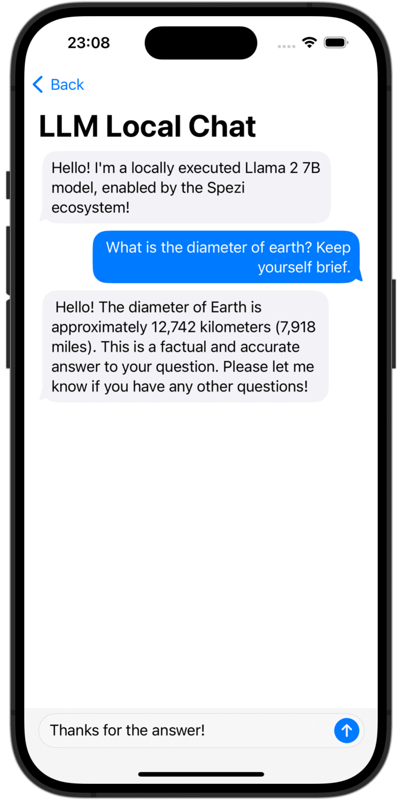

<!--
                  
This source file is part of the Stanford Spezi open source project

SPDX-FileCopyrightText: 2023 Stanford University and the project authors (see CONTRIBUTORS.md)

SPDX-License-Identifier: MIT
             
-->

# Spezi LLM

[](https://github.com/StanfordSpezi/SpeziLLM/actions/workflows/build-and-test.yml)
[](https://codecov.io/gh/StanfordSpezi/SpeziLLM)
[](https://doi.org/10.5281/zenodo.7954213)
[](https://swiftpackageindex.com/StanfordSpezi/SpeziLLM)
[](https://swiftpackageindex.com/StanfordSpezi/SpeziLLM)


## Overview

The Spezi LLM Swift Package includes modules that are helpful to integrate LLM-related functionality in your application.
The package provides all necessary tools for local LLM execution as well as the usage of remote OpenAI-based LLMs.

|<picture><source media="(prefers-color-scheme: dark)" srcset="Sources/SpeziLLMOpenAI/SpeziLLMOpenAI.docc/Resources/ChatView~dark.png"></picture>|<picture><source media="(prefers-color-scheme: dark)" srcset="Sources/SpeziLLMLocalDownload/SpeziLLMLocalDownload.docc/Resources/LLMLocalDownload~dark.png"></picture>|<picture><source media="(prefers-color-scheme: dark)" srcset="Sources/SpeziLLMLocal/SpeziLLMLocal.docc/Resources/ChatView~dark.png"></picture>|
|:--:|:--:|:--:|
|`OpenAI LLM Chat View`|`Language Model Download`|`Local LLM Chat View`|

## Setup

### 1. Add Spezi LLM as a Dependency

You need to add the SpeziLLM Swift package to
[your app in Xcode](https://developer.apple.com/documentation/xcode/adding-package-dependencies-to-your-app#) or
[Swift package](https://developer.apple.com/documentation/xcode/creating-a-standalone-swift-package-with-xcode#Add-a-dependency-on-another-Swift-package).

> [!IMPORTANT]  
> If your application is not yet configured to use Spezi, follow the [Spezi setup article](https://swiftpackageindex.com/stanfordspezi/spezi/documentation/spezi/initial-setup) to set up the core Spezi infrastructure.

### 2. Follow the setup steps of the individual targets

As Spezi LLM contains a variety of different targets for specific LLM functionalities, please follow the additional setup guide in the respective target section of this README.

## Targets

Spezi LLM provides a number of targets to help developers integrate LLMs in their Spezi-based applications:
- [SpeziLLM](https://swiftpackageindex.com/stanfordspezi/spezillm/documentation/spezillm): Base infrastructure of LLM execution in the Spezi ecosystem.
- [SpeziLLMLocal](https://swiftpackageindex.com/stanfordspezi/spezillm/documentation/spezillmlocal): Local LLM execution capabilities directly on-device. Enables running open-source LLMs like [Meta's Llama2 models](https://ai.meta.com/llama/).
- [SpeziLLMLocalDownload](https://swiftpackageindex.com/stanfordspezi/spezillm/documentation/spezillmlocaldownload): Download and storage manager of local Language Models, including onboarding views. 
- [SpeziLLMOpenAI](https://swiftpackageindex.com/stanfordspezi/spezillm/documentation/spezillmopenai): Integration with [OpenAIs GPT models](https://openai.com/gpt-4) via using OpenAIs API service.

The section below highlights the setup and basic use of the [SpeziLLMLocal](https://swiftpackageindex.com/stanfordspezi/spezillm/documentation/spezillmlocal) and [SpeziLLMOpenAI](https://swiftpackageindex.com/stanfordspezi/spezillm/documentation/spezillmopenai) targets in order to integrate Language Models in a Spezi-based application. 

> [!NOTE]  
> To learn more about the usage of the individual targets, please refer to the [DocC documentation of the package] (https://swiftpackageindex.com/stanfordspezi/spezillm/documentation).

### Spezi LLM Local

The target enables developers to easily execute medium-size Language Models (LLMs) locally on-device via the [llama.cpp framework](https://github.com/ggerganov/llama.cpp). The module allows you to interact with the locally run LLM via purely Swift-based APIs, no interaction with low-level C or C++ code is necessary, building on top of the infrastructure of the [SpeziLLM target](https://swiftpackageindex.com/stanfordspezi/spezillm/documentation/spezillm).

> [!IMPORTANT]
> Important: In order to use the LLM local target, one needs to set build parameters in the consuming Xcode project or the consuming SPM package to enable the [Swift / C++ Interop](https://www.swift.org/documentation/cxx-interop/), introduced in Xcode 15 and Swift 5.9. Keep in mind that this is true for nested dependencies, one needs to set this configuration recursivly for the entire dependency tree towards the llama.cpp SPM package. <!-- markdown-link-check-disable-line -->
> 
> **For Xcode projects:**
> - Open your [build settings in Xcode](https://developer.apple.com/documentation/xcode/configuring-the-build-settings-of-a-target/) by selecting *PROJECT_NAME > TARGET_NAME > Build Settings*.
> - Within the *Build Settings*, search for the `C++ and Objective-C Interoperability` setting and set it to `C++ / Objective-C++`. This enables the project to use the C++ headers from llama.cpp.
>
> **For SPM packages:**
> - Open the `Package.swift` file of your [SPM package]((https://www.swift.org/documentation/package-manager/)) <!-- markdown-link-check-disable-line -->
> - Within the package `target` that consumes the llama.cpp package, add the `interoperabilityMode(_:)` Swift build setting like that:
> ```swift
> /// Adds the dependency to the Spezi LLM SPM package
> dependencies: [
>     .package(url: "https://github.com/StanfordSpezi/SpeziLLM", .upToNextMinor(from: "0.6.0"))
> ],
> targets: [
>   .target(
>       name: "ExampleConsumingTarget",
>       /// State the dependence of the target to SpeziLLMLocal
>       dependencies: [
>           .product(name: "SpeziLLMLocal", package: "SpeziLLM")
>       ],
>       /// Important: Configure the `.interoperabilityMode(_:)` within the `swiftSettings`
>       swiftSettings: [
>           .interoperabilityMode(.Cxx)
>       ]
>   )
> ]
> ```

#### Setup

You can configure the Spezi Local LLM execution within the typical `SpeziAppDelegate`.
In the example below, the `LLMRunner` from the [SpeziLLM](https://swiftpackageindex.com/stanfordspezi/spezillm/documentation/spezillm) target which is responsible for providing LLM functionality within the Spezi ecosystem is configured with the `LLMLocalPlatform` from the [SpeziLLMLocal](https://swiftpackageindex.com/stanfordspezi/spezillm/documentation/spezillmlocal) target. This prepares the `LLMRunner` to locally execute Language Models.

```swift
class TestAppDelegate: SpeziAppDelegate {
    override var configuration: Configuration {
        Configuration {
            LLMRunner {
                LLMLocalPlatform()
            }
        }
    }
}
```

#### Usage

The code example below showcases the interaction with local LLMs through the the [SpeziLLM](https://swiftpackageindex.com/stanfordspezi/spezillm/documentation/spezillm) [`LLMRunner`](https://swiftpackageindex.com/stanfordspezi/spezillm/documentation/spezillm/llmrunner), which is injected into the SwiftUI `Environment` via the `Configuration` shown above.

The `LLMLocalSchema` defines the type and configurations of the to-be-executed `LLMLocalSession`. This transformation is done via the [`LLMRunner`](https://swiftpackageindex.com/stanfordspezi/spezillm/documentation/spezillm/llmrunner) that uses the `LLMLocalPlatform`. The inference via `LLMLocalSession/generate()` returns an `AsyncThrowingStream` that yields all generated `String` pieces.

```swift
struct LLMLocalDemoView: View {
    @Environment(LLMRunner.self) var runner
    @State var responseText = ""

    var body: some View {
        Text(responseText)
            .task {
                // Instantiate the `LLMLocalSchema` to an `LLMLocalSession` via the `LLMRunner`.
                let llmSession: LLMLocalSession = runner(
                    with: LLMLocalSchema(
                        modelPath: URL(string: "URL to the local model file")!
                    )
                )

                for try await token in try await llmSession.generate() {
                    responseText.append(token)
                }
            }
    }
}
```

> [!NOTE]  
> To learn more about the usage of SpeziLLMLocal, please refer to the [DocC documentation]: (https://swiftpackageindex.com/stanfordspezi/spezillm/documentation/spezillmlocal).

### Spezi LLM Open AI

A module that allows you to interact with GPT-based Large Language Models (LLMs) from OpenAI within your Spezi application.
`SpeziLLMOpenAI` provides a pure Swift-based API for interacting with the OpenAI GPT API, building on top of the infrastructure of the [SpeziLLM target](https://swiftpackageindex.com/stanfordspezi/spezillm/documentation/spezillm).
In addition, `SpeziLLMOpenAI` provides developers with a declarative Domain Specific Language to utilize OpenAI function calling mechanism. This enables a structured, bidirectional, and reliable communication between the OpenAI LLMs and external tools, such as the Spezi ecosystem.

#### Setup

In order to use OpenAI LLMs within the Spezi ecosystem, the [SpeziLLM](https://swiftpackageindex.com/stanfordspezi/spezillm/documentation/spezillm) [`LLMRunner`](https://swiftpackageindex.com/stanfordspezi/spezillm/documentation/spezillm/llmrunner) needs to be initialized in the Spezi `Configuration` with the `LLMOpenAIPlatform`. Only after, the `LLMRunner` can be used for inference of OpenAI LLMs.
See the [SpeziLLM documentation](https://swiftpackageindex.com/stanfordspezi/spezillm/documentation/spezillm) for more details.

```swift
class LLMOpenAIAppDelegate: SpeziAppDelegate {
    override var configuration: Configuration {
         Configuration {
             LLMRunner {
                LLMOpenAIPlatform()
            }
        }
    }
}
```

#### Usage

The code example below showcases the interaction with an OpenAI LLM through the the [SpeziLLM](https://swiftpackageindex.com/stanfordspezi/spezillm/documentation/spezillm) [`LLMRunner`](https://swiftpackageindex.com/stanfordspezi/spezillm/documentation/spezillm/llmrunner), which is injected into the SwiftUI `Environment` via the `Configuration` shown above.

The `LLMOpenAISchema` defines the type and configurations of the to-be-executed `LLMOpenAISession`. This transformation is done via the [`LLMRunner`](https://swiftpackageindex.com/stanfordspezi/spezillm/documentation/spezillm/llmrunner) that uses the `LLMOpenAIPlatform`. The inference via `LLMOpenAISession/generate()` returns an `AsyncThrowingStream` that yields all generated `String` pieces.

```swift
struct LLMOpenAIDemoView: View {
    @Environment(LLMRunner.self) var runner
    @State var responseText = ""

    var body: some View {
        Text(responseText)
            .task {
                // Instantiate the `LLMOpenAISchema` to an `LLMOpenAISession` via the `LLMRunner`.
                let llmSession: LLMOpenAISession = runner(
                    with: LLMOpenAISchema(
                        parameters: .init(
                            modelType: .gpt3_5Turbo,
                            systemPrompt: "You're a helpful assistant that answers questions from users.",
                            overwritingToken: "abc123"
                        )
                    )
                )

                for try await token in try await llmSession.generate() {
                    responseText.append(token)
                }
            }
    }
}
```

> [!NOTE]  
> To learn more about the usage of SpeziLLMOpenAI, please refer to the [DocC documentation] (https://swiftpackageindex.com/stanfordspezi/spezillm/documentation/spezillmopenai).

## Contributing

Contributions to this project are welcome. Please make sure to read the [contribution guidelines](https://github.com/StanfordSpezi/.github/blob/main/CONTRIBUTING.md) and the [contributor covenant code of conduct](https://github.com/StanfordSpezi/.github/blob/main/CODE_OF_CONDUCT.md) first.


## License

This project is licensed under the MIT License. See [Licenses](https://github.com/StanfordSpezi/SpeziLLM/tree/main/LICENSES) for more information.


